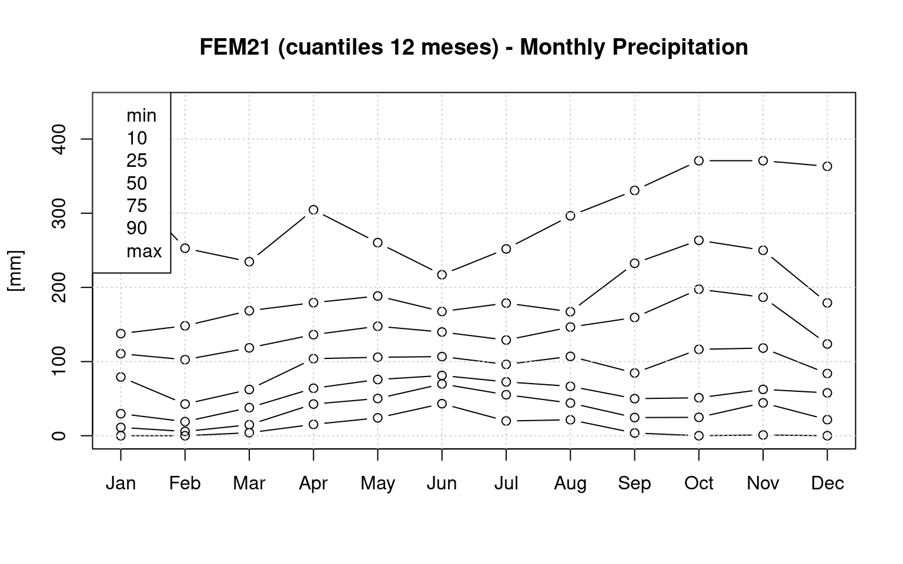
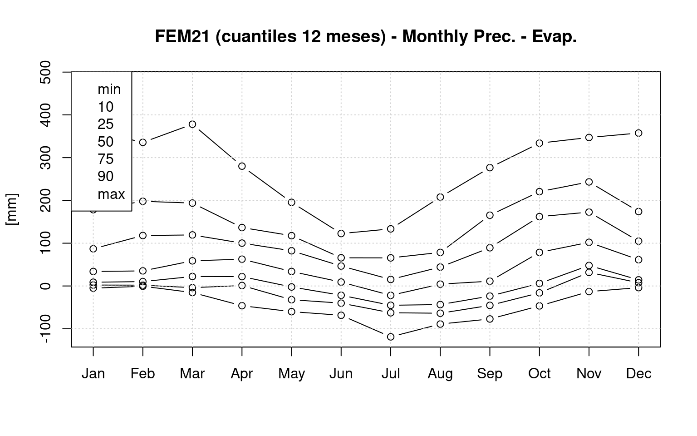

Demo 1 — ClimClass: clasificación climática y balance hídrico
================
El tali
2025-09-02

- [Objetivo y flujo lógico](#objetivo-y-flujo-lógico)
- [Paquetes](#paquetes)
- [Datos de ejemplo de `ClimClass`](#datos-de-ejemplo-de-climclass)
- [Normales climáticas (1981–2010)](#normales-climáticas-19812010)
- [Clasificaciones e índices](#clasificaciones-e-índices)
  - [Köppen–Geiger](#köppengeiger)
  - [Índices de aridez](#índices-de-aridez)
  - [Índices de
    continentalidad/oceanicidad](#índices-de-continentalidadoceanicidad)
- [Gráficos climáticos estándar](#gráficos-climáticos-estándar)
  - [Bagnouls–Gaussen](#bagnoulsgaussen)
  - [Peguy](#peguy)
- [Balance hídrico
  (Thornthwaite–Mather)](#balance-hídrico-thornthwaitemather)
- [Interpretación biogeográfica
  (guion)](#interpretación-biogeográfica-guion)
- [Adaptación del flujo a tus datos](#adaptación-del-flujo-a-tus-datos)
- [Sesión](#sesión)

# Objetivo y flujo lógico

Este cuaderno muestra un **flujo reproducible** con
[`ClimClass`](https://cran.r-project.org/web/packages/ClimClass/index.html):

1.  **Datos de ejemplo** incluidos en el paquete: estructura y formato
    requeridos.
2.  Cálculo de **normales climáticas** (mensuales) a partir de series.
3.  **Clasificación** climática (Köppen–Geiger), **índices de aridez** y
    **continentalidad**.
4.  **Balance hídrico** de Thornthwaite–Mather y gráficos estándar
    (Bagnouls–Gaussen, Peguy, cuantiles WB).
5.  **Interpretación biogeográfica**: implicaciones para la distribución
    de plantas.

> Todo el código es visible. No se descarga nada: se usan **datos de
> ejemplo** que trae el paquete.

# Paquetes

``` r
# Instala ClimClass si hace falta
if (!requireNamespace("ClimClass", quietly = TRUE)) install.packages("ClimClass")
# Otros paquetes útiles
for (p in c("ClimClass","dplyr","tidyr","ggplot2","stringr")) {
  if (!requireNamespace(p, quietly = TRUE)) install.packages(p)
  library(p, character.only = TRUE)
}
```

# Datos de ejemplo de `ClimClass`

`ClimClass` incluye un conjunto de objetos de ejemplo bajo el nombre
`Trent_climate`.

``` r
# Carga todos los objetos del dataset de ejemplo
data("Trent_climate", package = "ClimClass")
# Objetos esperados (puede variar según versión)
expected <- c("lista_cli","clima_81_10","coord_elev","arid_ind_tables",
              "continental_ind_tables","coeff_rad","quantiles","thornt_lst")
available <- intersect(expected, ls())
cat("Objetos disponibles:\n\n")
```

    ## Objetos disponibles:

``` r
print(available)
```

    ## [1] "lista_cli"              "clima_81_10"            "coord_elev"            
    ## [4] "arid_ind_tables"        "continental_ind_tables" "coeff_rad"             
    ## [7] "quantiles"              "thornt_lst"

Cada elemento de `lista_cli` es una **serie mensual** con columnas
típicas: - `year`, `month`, `P` (precipitación), `Tn`, `Tx` y
opcionalmente `Tm` (temperatura media).

Elegimos una estación para la demo:

``` r
# Nombres de estaciones
sta_names <- names(lista_cli)
sta <- sta_names[1]         # <- cambia si quieres otra
series <- lista_cli[[sta]]
# Vista rápida de la serie
head(series)
```

    ##   year month     P         Tn         Tx
    ## 1 1958     1  80.4 -4.3870968  0.7419355
    ## 2 1958     2 118.5 -0.2142857  4.7500000
    ## 3 1958     3  60.7 -2.5483871  3.2580645
    ## 4 1958     4 304.6  1.4666667  7.3666667
    ## 5 1958     5  72.7 10.0967742 18.8709677
    ## 6 1958     6 102.6 10.9000000 19.5333333

# Normales climáticas (1981–2010)

``` r
clim_norm <- climate(series, first.yr = 1981, last.yr = 2010, max.perc.missing = 15)
clim_norm
```

    ##    month     P   Tn   Tx   Tm AbsTn
    ## 1      1  66.0 -3.6  3.1 -0.2  -7.4
    ## 2      2  53.0 -3.5  4.1  0.3  -7.7
    ## 3      3  70.9 -0.3  8.2  4.0  -4.2
    ## 4      4 104.3  3.1 11.6  7.3  -0.5
    ## 5      5 113.3  7.4 16.7 12.1   2.4
    ## 6      6 109.7 10.6 20.3 15.5   7.1
    ## 7      7  99.8 12.9 22.9 17.9   9.4
    ## 8      8 102.3 12.5 22.2 17.4   9.6
    ## 9      9 108.6  8.9 17.5 13.2   4.9
    ## 10    10 140.1  5.1 12.4  8.8   1.1
    ## 11    11 120.4  0.3  6.7  3.5  -3.8
    ## 12    12  90.0 -2.7  3.4  0.3  -6.0

# Clasificaciones e índices

## Köppen–Geiger

``` r
kg <- koeppen_geiger(clim_norm, A_B_C_special_sub.classes = TRUE)
kg
```

    ##   T_w.m T_c.m T_avg  P_tot P_wint P_summ P_d.m P_d.m.summ P_d.m.wint P_w.m
    ## 1  17.9  -0.2   8.3 1178.4  504.6  673.8    53       99.8         53 140.1
    ##   P_w.m.summ P_w.m.wint T_4th_w.m class
    ## 1      140.1      120.4      13.2   Cfb

## Índices de aridez

Para los índices basados en radiación (p. ej. **Thornthwaite Im**), se
usan coeficientes de **radiación extra-atmosférica** (`ExAtRa`).

``` r
# Coordenadas/altura de la estación (asumiendo el mismo orden que en los datos)
idx <- which(names(lista_cli) == sta)
latitude <- if ("coord_elev" %in% ls()) coord_elev$North[idx] else 46
# Día del año de los días 15 de cada mes (12 valores)
mid <- as.Date(sprintf("2014-%02d-15", 1:12))
doy <- as.integer(strftime(mid, "%j"))
coeff_rad <- ExAtRa(DOY = doy, latitude = latitude, unit = "mm")

# Índices de aridez (anuales y mensuales)
arid_ann <- arid(clim_norm, coeff_rad = coeff_rad, monthly = FALSE)
arid_mon <- arid(clim_norm, coeff_rad = coeff_rad, monthly = TRUE)

arid_ann
```

    ##      Ia     Im      Q      R    Io   Ai
    ## 1 64.25 107.14 157.24 141.27 11.09 2.07

``` r
head(arid_mon)
```

    ## $Ia
    ##    Jan    Feb    Mar    Apr    May    Jun    Jul    Aug    Sep    Oct    Nov 
    ##  80.82  61.75  60.77  72.35  61.52  51.62  42.92  44.80  56.17  89.43 107.02 
    ##    Dec 
    ## 104.85 
    ## 
    ## $Im
    ##   Jan   Feb   Mar   Apr   May   Jun   Jul   Aug   Sep   Oct   Nov   Dec 
    ## 10.97  8.21  8.51 10.63  9.13  7.61  6.25  6.55  8.29 13.59 15.87 14.79

## Índices de continentalidad/oceanicidad

``` r
# Elevación si está disponible
elev <- if ("coord_elev" %in% ls()) coord_elev$Elevation[idx] else NA
cont <- contin(clim_norm, latitude = latitude, elevation = elev, Michalet_correction = TRUE)
cont
```

    ##     K.G   K.C alpha   Ic     H
    ## 1 22.46 23.17 39.08 18.1 543.1

# Gráficos climáticos estándar

## Bagnouls–Gaussen

``` r
bagn_gau(clim_norm_sta = clim_norm, main_title = paste(sta, "(1981–2010)"))
```


## Peguy

``` r
peguy(data = clim_norm, xlab = "Mes", ylab = "Valor")
```


# Balance hídrico (Thornthwaite–Mather)

La función `thornthwaite()` calcula el balance mensual (**P, Et0,
Storage, P−Et0, Deficit, Surplus**) y, opcionalmente, cuantiles
climatológicos. Por claridad usamos la **serie mensual** original y las
**normales** calculadas.

``` r
wb <- thornthwaite(series = series,
                   clim_norm = clim_norm,
                   quant = c(0, .1, .25, .5, .75, .9, 1),
                   snow.init = 20, Tsnow = -1,
                   TAW = 100,
                   latitude = 46)
# La lista de cuantiles suele estar en el segundo elemento del resultado
q_list <- tryCatch(wb[[2]], error = function(e) NULL)
if (!is.null(q_list)) {
  class(q_list) <- "thornthwaite"
  plot(q_list, variables = c("Precipitation","Et0","Storage","Prec. - Evap.","Deficit","Surplus"),
       st_name = paste(sta, "(cuantiles 12 meses)"))
}
```



Extraemos una tabla mensual de **déficit** y **superávit** (si la
estructura está disponible):

``` r
# Intento de extraer tablas de balance (la estructura puede variar según versión del paquete)
wb_tables <- try(names(wb), silent = TRUE)
if (!inherits(wb_tables, "try-error")) print(wb_tables)
```

    ## [1] "W_balance" "quantiles"

``` r
# Si el primer elemento contiene las series mensuales, lo mostramos
wb_mensual <- try(wb[[1]], silent = TRUE)
if (!inherits(wb_mensual, "try-error")) {
  # Esperamos columnas como: Precipitation, Et0, Storage, Prec. - Evap., Deficit, Surplus
  print(head(wb_mensual))
}
```

    ## $Precipitation
    ##      1958  1959  1960  1961  1962  1963  1964  1965  1966  1967  1968  1969
    ## Jan  80.4  44.4  92.7 138.8  85.9 122.2  11.2  69.7  69.0  20.3  83.2 133.5
    ## Feb 118.5   0.0 190.2  25.5  42.7 102.5  25.9   3.5  56.5  84.6 180.6 135.4
    ## Mar  60.7 135.2 112.9  11.2  81.2 101.0 185.3 162.4  13.7  40.5  24.8  49.3
    ## Apr 304.6 168.8  57.0 111.3 180.3 137.7 174.1 114.5  58.0 160.1  84.9  53.4
    ## May  72.7 104.1  41.6 130.8 182.1 156.4  73.3 127.8  75.8  96.1 192.1  73.7
    ## Jun 102.6 119.2 119.0  90.2  89.9 125.8  80.5  76.4  81.2  96.1 192.6 139.8
    ## Jul  74.2 170.9 127.8 104.9 100.6  56.4  65.5 191.3 229.7  57.2  91.6  67.4
    ## Aug 125.9  24.9 130.8  24.2  21.5 283.4 112.9 161.8 296.5 149.1 285.6 167.9
    ## Sep  48.2  66.4 301.5   5.2  49.9 147.9  32.2 200.7  58.5 159.4  69.9  56.1
    ## Oct 116.5 197.5 370.8  90.1  39.5  54.3 253.7  23.9 265.7  41.1  18.4   0.0
    ## Nov 166.1 284.4 184.0 234.4 262.7 312.1 103.0 186.7 250.7 186.7 247.3 118.2
    ## Dec 268.6 363.2 188.3 123.6  83.2  89.0 109.3 123.7  67.8  21.3  69.4  74.7
    ##      1970  1971  1972  1973  1974  1975  1976  1977  1978  1979  1980  1981
    ## Jan 117.1 119.3 109.4  79.2  23.1  82.6  14.0 279.7 309.3 154.6  85.1   3.8
    ## Feb  35.9  61.5 183.0  26.7 135.5  30.0  54.9 123.0 203.9 139.5  40.6   4.2
    ## Mar 118.5  95.8  85.8  10.2  74.5 170.1  25.1 175.6  48.8 201.5 136.0 149.2
    ## Apr 120.1  70.2 103.9 135.4 113.1 145.9 127.3  87.5  83.6 110.0  18.1  60.0
    ## May  85.9 171.6 136.2  27.2  83.6 208.5 104.5 260.3 147.6  24.1  79.1 117.1
    ## Jun  78.3 155.7 168.4 175.7 148.3 154.5  43.9 157.3 114.0 106.7 152.1  94.8
    ## Jul  90.2  88.4 186.2 180.8  58.0  84.8 115.5 148.8 106.1  32.7  55.0 182.0
    ## Aug 130.6 120.4  70.8  65.0  26.8 164.3 128.2 161.2  46.0 146.5  51.5  77.2
    ## Sep  88.3  46.4  93.1 176.1 155.9 136.1 330.7  69.3  42.8 171.9  15.1 249.4
    ## Oct  58.5  24.3  70.0 117.4  85.5  99.3 265.9  51.2 158.0 153.2 268.0 178.1
    ## Nov 181.7 160.6  94.5  44.5  59.2 110.8 112.4  45.6  62.5 119.0  86.4   1.0
    ## Dec  83.9  63.2  76.9 105.2  20.0  94.4  91.6  95.8 169.6 155.7  28.5 168.0
    ##      1982  1983  1984  1985  1986  1987  1988  1989  1990  1991  1992  1993
    ## Jan  44.3   2.2  34.3 346.2 130.1  87.7 125.1   0.0  33.9  29.7  28.8   0.0
    ## Feb  25.4  15.2  97.3   7.5 252.8 150.4  80.1 139.2  19.0  47.9  18.4   0.0
    ## Mar  48.9 136.2  73.7 210.9  37.9  37.6  66.0  48.8  35.4 107.2  38.3  43.5
    ## Apr  15.3 120.1  95.4  71.8 208.2 130.4  95.5 290.6 136.3  39.2 186.1 114.8
    ## May 105.8 190.0 206.6 160.3  88.0 155.9 141.4  74.9  29.4 109.0  61.6 130.6
    ## Jun  69.9  51.5  69.7 104.0 126.1 122.2 175.8 138.3 104.3  85.7 213.7 126.2
    ## Jul  72.6  19.9  67.2  30.6  83.2  97.1 101.4 142.7  86.4 251.9 141.2  96.6
    ## Aug 102.4  68.7 142.7 141.2 136.9 107.0  70.4  78.2  43.5  97.1  61.5  85.3
    ## Sep  23.1  91.8 147.2   3.7  54.8  48.8  29.9  73.4  53.1 101.4 138.4 274.8
    ## Oct 211.3  81.7 145.4  51.5  34.7 214.7  88.0  15.8 139.1 167.9 357.7 351.1
    ## Nov 210.2   5.7  76.5  94.5  58.9 122.5   7.0  50.5 160.4 115.1  69.9  46.6
    ## Dec 107.2 234.6 104.6  82.2  26.5  27.9  55.2  23.5 142.9   3.1 174.9  43.3
    ##      1994  1995  1996  1997  1998  1999  2000  2001  2002  2003  2004  2005
    ## Jan 123.7  48.0 110.6 104.8  50.9  94.0   0.0 139.2  23.7  71.9  23.7  11.3
    ## Feb  32.2  83.7  32.3   5.4  15.4  10.5   9.3  39.0  72.8   3.3  92.5   8.1
    ## Mar  20.1  43.6  21.6   9.0   4.1 130.1  93.2 234.6  40.4   5.8 101.5  19.4
    ## Apr  95.2  87.5  50.4  40.8 222.1 113.0 112.6  58.8 101.5  56.4  86.6  97.4
    ## May 123.6 167.9 128.0  66.1  94.2 114.0  47.4  97.0 207.2  76.2 102.0  78.4
    ## Jun  59.2 110.9 164.0 217.1  43.2 118.8 163.2  78.0 137.8  94.4  93.2  71.0
    ## Jul 136.1  46.9  97.9 109.4  96.2  73.6 102.2  91.6 104.4 129.0  67.6 131.0
    ## Aug  43.6  91.9 111.6 106.8  71.6  66.6 148.2 119.0 161.0  63.6  59.2  94.0
    ## Sep 243.8 211.9  60.3   5.6 190.8 190.4  84.6 133.4  83.0  21.8  50.0  50.0
    ## Oct  72.3   0.0 254.9  26.6 184.6 184.6 234.2  37.4 100.0 215.9 189.1 171.2
    ## Nov 116.0  44.3 228.5 172.5  48.3  79.8 332.2  27.2 370.8 202.3 131.1  63.3
    ## Dec  33.9 125.7 104.3 115.1  17.5  65.6  69.8   0.0  67.8 107.6  80.1  82.6
    ##      2006  2007  2008  2009  2010
    ## Jan  45.5  48.8  84.6  88.7  45.1
    ## Feb  52.6  26.8  38.0 118.6  91.9
    ## Mar  96.7  52.2  38.8 120.6  62.3
    ## Apr  64.0  16.8 152.2 175.8  34.3
    ## May  68.4 138.6 161.6  28.6 129.4
    ## Jun  79.6  90.6 132.2  69.8  86.0
    ## Jul  47.4  74.8 136.8  91.2  84.4
    ## Aug 194.8 205.4 110.4  51.8 158.2
    ## Sep  65.0  85.6 161.2  92.2 237.6
    ## Oct  46.2  41.6 130.4  72.2 203.4
    ## Nov  22.8 152.6 215.3 143.2 242.9
    ## Dec  57.8   0.8 179.1 178.9 220.5
    ## 
    ## $Et0
    ##      1958  1959  1960  1961  1962  1963  1964  1965  1966  1967  1968  1969
    ## Jan   0.0   0.0   0.0   0.0   2.0   0.0   0.0   1.5   0.0   0.0   0.0   1.7
    ## Feb   9.5  11.4   0.0   8.3   5.6   0.0   1.0   0.0  20.7   1.8   7.4   0.0
    ## Mar   1.6  29.5  19.9  25.9  10.6   6.1  14.5  23.7  19.9  32.3  21.3  18.2
    ## Apr  24.5  40.6  44.4  54.7  41.8  45.7  45.2  43.6  52.1  35.6  55.7  42.9
    ## May  90.7  70.2  78.1  62.0  63.5  73.9  83.2  79.7  79.9  77.0  78.8  90.0
    ## Jun 100.5 104.3 103.5 102.6  98.0  98.9 104.6 117.6 100.5  95.5 104.3  93.2
    ## Jul 112.4 119.2  98.9 104.1 105.3 118.4 125.8 104.3 100.6 120.0 117.5 113.5
    ## Aug 100.8  96.6  95.7  99.1 110.5  89.6  99.5  81.7  88.7  94.0  88.0  96.1
    ## Sep  76.1  70.7  63.7  82.3  73.5  72.2  71.3  69.5  77.3  70.1  65.6  72.6
    ## Oct  38.0  35.4  36.9  41.8  46.6  43.7  42.5  37.5  50.1  50.8  47.1  46.6
    ## Nov  21.0  14.4  17.7  13.1  12.0  23.2  22.6  14.0   4.1  26.5  17.6  17.2
    ## Dec   2.1   5.7   6.2   0.3   0.0   0.0   4.3   4.4   0.0   0.9   0.0   0.0
    ##      1970  1971  1972  1973  1974  1975  1976  1977  1978  1979  1980  1981
    ## Jan   0.7   0.0   0.0   5.1  10.1   8.0   0.0   0.0   0.0   0.0   0.0   0.0
    ## Feb   0.6   5.8  14.6   2.5  12.1   7.3   7.7   5.0   0.0   7.8  10.5   2.1
    ## Mar  12.3   5.7  32.2  16.0  24.3  17.7  14.3  29.0  19.8  20.8  24.8  29.9
    ## Apr  34.4  49.9  44.1  28.9  39.2  45.7  45.5  35.9  33.4  33.9  37.8  52.1
    ## May  63.1  76.2  73.4  82.6  73.2  76.4  80.8  64.8  65.3  83.0  69.5  74.5
    ## Jun 111.6  96.0 101.2 107.7  95.9  93.6 112.4  99.3  95.9 110.6  99.3 108.2
    ## Jul 112.1 118.3 110.0 111.6 116.4 112.1 117.7 110.1 109.1 118.9 107.3 102.8
    ## Aug 103.8 111.2  98.6 108.4 111.4  96.2  83.1  91.5  95.0 102.3 111.0 101.6
    ## Sep  80.3  66.6  55.6  76.9  69.3  75.9  54.1  64.6  71.4  70.4  80.7  74.3
    ## Oct  40.5  41.0  36.3  36.8  22.0  37.8  39.9  45.2  39.8  42.3  40.3  38.9
    ## Nov  20.0  16.2  16.1  13.4  13.6   9.1  12.8  11.7  14.6  16.9  15.5  14.1
    ## Dec   0.0  10.8   4.8   0.4   6.4   3.5   0.0   0.0   0.0   9.4   3.4   0.0
    ##      1982  1983  1984  1985  1986  1987  1988  1989  1990  1991  1992  1993
    ## Jan   2.1   7.3   0.0   0.0   0.0   0.0   1.6   1.2   0.0   0.0   0.0   0.0
    ## Feb   2.6   0.0   0.0   0.7   0.0   1.1   0.0   6.0  12.4   0.0   1.1   0.0
    ## Mar  15.9  22.4  14.9  13.8  15.9   0.1  11.7  26.6  26.4  26.0  13.3  10.8
    ## Apr  40.1  43.2  42.3  39.8  34.1  40.8  44.5  32.6  31.1  26.1  34.0  38.3
    ## May  74.6  67.1  59.2  75.9  88.7  60.8  77.2  75.2  77.4  50.9  80.3  79.0
    ## Jun 110.9 107.4 103.2  99.6  99.2  94.6  93.1  92.6  95.2  93.0  91.1 104.6
    ## Jul 122.6 138.8 119.7 129.5 108.5 120.0 117.5 111.7 110.1 118.4 115.1 103.6
    ## Aug  99.9 102.3 100.1 100.9 101.6 102.0 102.9  96.5  98.8 106.9 118.2 104.9
    ## Sep  80.9  75.3  68.9  78.1  71.9  86.3  66.6  65.5  66.1  72.9  68.9  59.0
    ## Oct  39.4  42.3  44.6  44.3  44.3  41.3  41.3  34.4  41.3  29.8  26.0  31.3
    ## Nov  19.3  11.7  19.5   7.0  14.7  14.8   0.0   5.5   9.5   5.2  12.7   2.8
    ## Dec   5.0   2.5   5.7   8.0   0.0   5.9   0.0   0.0   0.0   0.0   0.0   0.0
    ##      1994  1995  1996  1997  1998  1999  2000  2001  2002  2003  2004  2005
    ## Jan   0.0   0.0   0.0   0.0   0.0   7.1   1.9   1.7   4.0   1.3   0.0   1.6
    ## Feb   0.0   2.8   0.0   1.2   1.2   0.3   9.9  10.2  13.4   0.0   6.8   0.0
    ## Mar  26.1   5.5  20.2  19.4  19.5  21.0  24.5  26.7  30.0  23.3  15.8  18.7
    ## Apr  29.6  36.2  58.0  40.8  40.9  43.2  46.7  34.0  38.8  34.5  41.1  38.4
    ## May  73.0  67.7  80.7  75.5  75.6  80.4  82.9  85.5  73.8  84.2  61.1  80.4
    ## Jun  98.3  84.2 102.9 102.4 102.5  96.8 107.8  95.5 111.0 129.1 102.4 111.4
    ## Jul 118.4 124.0 107.0 116.4 116.5 114.6  98.3 115.8 112.1 117.2 112.1 115.7
    ## Aug 109.1  92.4  95.1 104.2 115.2 110.0 107.6 111.9  98.6 125.5 107.3  93.5
    ## Sep  63.8  56.8  52.4  69.8  67.3  77.4  73.4  55.1  64.2  68.7  74.7  75.1
    ## Oct  31.9  44.1  33.2  40.3  30.5  44.1  43.8  54.7  42.5  27.7  48.9  41.9
    ## Nov  17.6   8.2   7.2  13.6   9.4  12.6  16.6  14.9  23.7  17.1  18.7  13.3
    ## Dec   0.9   0.0   0.0   1.0   3.8   0.4   9.1   0.0   6.4   5.7   8.0   0.0
    ##      2006  2007  2008  2009  2010
    ## Jan   0.0  11.1   8.2   0.7   0.0
    ## Feb   0.9  15.6  11.0   2.9   0.9
    ## Mar   9.8  24.7  19.2  17.9  16.1
    ## Apr  42.1  62.9  38.5  48.6  46.3
    ## May  70.7  80.8  76.5  88.6  70.1
    ## Jun 105.5 104.2 106.2 101.3 107.7
    ## Jul 130.3 114.9 114.3 114.7 129.5
    ## Aug  85.8  96.9 106.1 116.0 102.9
    ## Sep  81.4  63.7  65.4  78.3  69.6
    ## Oct  50.2  39.9  47.3  39.4  36.6
    ## Nov  23.0  11.9  16.6  18.5  16.9
    ## Dec  11.0   4.7   4.0   0.1   0.0
    ## 
    ## $Storage
    ##      1958  1959  1960  1961  1962  1963  1964  1965  1966  1967  1968  1969
    ## Jan 100.0 100.0 100.0 100.0 100.0 100.0 100.0 100.0 100.0 100.0 100.0 100.0
    ## Feb 100.0 100.0 100.0 100.0 100.0 100.0 100.0 100.0 100.0 100.0 100.0 100.0
    ## Mar 100.0 100.0 100.0  86.1 100.0 100.0 100.0 100.0  93.9 100.0 100.0 100.0
    ## Apr 100.0 100.0 100.0 100.0 100.0 100.0 100.0 100.0  99.8 100.0 100.0 100.0
    ## May  83.3 100.0  69.0 100.0 100.0 100.0  90.5 100.0  95.8 100.0 100.0  84.8
    ## Jun  85.4 100.0  84.5  88.2  92.1 100.0  70.8  65.8  78.8 100.0 100.0 100.0
    ## Jul  57.9 100.0 100.0  89.0  87.8  53.3  38.4 100.0 100.0  52.9  76.9  62.6
    ## Aug  83.1  48.3 100.0  41.6  35.6 100.0  51.9 100.0 100.0 100.0 100.0 100.0
    ## Sep  62.6  46.2 100.0  19.0  28.0 100.0  34.9 100.0  82.6 100.0 100.0  84.6
    ## Oct 100.0 100.0 100.0  67.3  26.1 100.0 100.0  87.1 100.0  90.6  74.7  52.7
    ## Nov 100.0 100.0 100.0 100.0 100.0 100.0 100.0 100.0 100.0 100.0 100.0 100.0
    ## Dec 100.0 100.0 100.0 100.0 100.0 100.0 100.0 100.0 100.0 100.0 100.0 100.0
    ##      1970  1971  1972  1973  1974  1975  1976 1977  1978  1979  1980  1981
    ## Jan 100.0 100.0 100.0 100.0 100.0 100.0 100.0  100 100.0 100.0 100.0 100.0
    ## Feb 100.0 100.0 100.0 100.0 100.0 100.0 100.0  100 100.0 100.0 100.0 100.0
    ## Mar 100.0 100.0 100.0  94.3 100.0 100.0 100.0  100 100.0 100.0 100.0 100.0
    ## Apr 100.0 100.0 100.0 100.0 100.0 100.0 100.0  100 100.0 100.0  81.8 100.0
    ## May 100.0 100.0 100.0  57.0 100.0 100.0 100.0  100 100.0  55.0  91.4 100.0
    ## Jun  71.3 100.0 100.0 100.0 100.0 100.0  49.9  100 100.0  52.9 100.0  87.3
    ## Jul  57.1  73.8 100.0 100.0  55.3  75.8  48.8  100  97.0  22.0  58.8 100.0
    ## Aug  83.9  83.0  75.4  64.4  23.4 100.0  93.9  100  59.0  66.2  32.2  78.0
    ## Sep  91.9  67.6 100.0 100.0 100.0 100.0 100.0  100  44.2 100.0  16.5 100.0
    ## Oct 100.0  57.0 100.0 100.0 100.0 100.0 100.0  100 100.0 100.0 100.0 100.0
    ## Nov 100.0 100.0 100.0 100.0 100.0 100.0 100.0  100 100.0 100.0 100.0  87.6
    ## Dec 100.0 100.0 100.0 100.0 100.0 100.0 100.0  100 100.0 100.0 100.0 100.0
    ##      1982  1983  1984  1985  1986  1987  1988  1989  1990  1991  1992  1993
    ## Jan 100.0  95.0 100.0 100.0 100.0 100.0 100.0  98.8 100.0 100.0 100.0 100.0
    ## Feb 100.0  96.5 100.0 100.0 100.0 100.0 100.0 100.0 100.0 100.0 100.0 100.0
    ## Mar 100.0 100.0 100.0 100.0 100.0 100.0 100.0 100.0 100.0 100.0 100.0 100.0
    ## Apr  77.7 100.0 100.0 100.0 100.0 100.0 100.0 100.0 100.0 100.0 100.0 100.0
    ## May 100.0 100.0 100.0 100.0  99.3 100.0 100.0  99.7  61.4 100.0  82.7 100.0
    ## Jun  66.0  56.7  71.2 100.0 100.0 100.0 100.0 100.0  70.6  92.9 100.0 100.0
    ## Jul  39.7  17.0  41.8  36.6  77.4  79.2  84.9 100.0  55.5 100.0 100.0  93.1
    ## Aug  42.2  12.1  84.3  77.0 100.0  84.2  61.1  83.0  31.7  90.6  56.2  76.3
    ## Sep  23.5  28.5 100.0  36.2  84.1  57.6  42.1  90.9  27.8 100.0 100.0 100.0
    ## Oct 100.0  68.0 100.0  43.4  76.3 100.0  88.8  75.3 100.0 100.0 100.0 100.0
    ## Nov 100.0  63.9 100.0 100.0 100.0 100.0  95.8 100.0 100.0 100.0 100.0 100.0
    ## Dec 100.0 100.0 100.0 100.0 100.0 100.0 100.0 100.0 100.0 100.0 100.0 100.0
    ##      1994  1995  1996  1997  1998  1999  2000  2001  2002  2003  2004  2005
    ## Jan 100.0 100.0 100.0 100.0 100.0 100.0  98.1 100.0 100.0 100.0 100.0 100.0
    ## Feb 100.0 100.0 100.0 100.0 100.0 100.0  97.5 100.0 100.0 100.0 100.0 100.0
    ## Mar 100.0 100.0 100.0  90.0  85.6 100.0 100.0 100.0 100.0  86.3 100.0 100.0
    ## Apr 100.0 100.0  92.5  90.0 100.0 100.0 100.0 100.0 100.0 100.0 100.0 100.0
    ## May 100.0 100.0 100.0  81.8 100.0 100.0  69.8 100.0 100.0  92.2 100.0  98.0
    ## Jun  67.3 100.0 100.0 100.0  54.8 100.0 100.0  83.8 100.0  64.8  91.1  65.0
    ## Jul  85.0  45.7  91.1  93.2  44.6  66.0 100.0  65.5  92.5  76.6  58.0  80.3
    ## Aug  43.7  45.5 100.0  95.8  28.7  42.5 100.0  72.7 100.0  40.9  35.6  80.9
    ## Sep 100.0 100.0 100.0  49.9 100.0 100.0 100.0 100.0 100.0  25.4  27.7  62.7
    ## Oct 100.0  63.9 100.0  43.5 100.0 100.0 100.0  83.9 100.0 100.0 100.0 100.0
    ## Nov 100.0  99.9 100.0 100.0 100.0 100.0 100.0  96.2 100.0 100.0 100.0 100.0
    ## Dec 100.0 100.0 100.0 100.0 100.0 100.0 100.0  96.2 100.0 100.0 100.0 100.0
    ##      2006  2007 2008  2009  2010
    ## Jan 100.0 100.0  100 100.0 100.0
    ## Feb 100.0 100.0  100 100.0 100.0
    ## Mar 100.0 100.0  100 100.0 100.0
    ## Apr 100.0  62.6  100 100.0  88.5
    ## May  97.7 100.0  100  54.4 100.0
    ## Jun  75.1  87.1  100  39.5  80.3
    ## Jul  32.4  58.0  100  31.1  50.8
    ## Aug 100.0 100.0  100  16.2 100.0
    ## Sep  84.7 100.0  100  30.1 100.0
    ## Oct  81.3 100.0  100  62.9 100.0
    ## Nov  81.2 100.0  100 100.0 100.0
    ## Dec 100.0  96.1  100 100.0 100.0
    ## 
    ## $`Prec. - Evap.`
    ##      1958  1959  1960  1961  1962  1963  1964  1965  1966  1967  1968  1969
    ## Jan   8.0   4.4   9.3  13.9  83.9  12.2   1.1  68.2   6.9   2.0   8.3 194.2
    ## Feb 205.4  30.8 278.3 149.1  37.1  10.3  35.6   0.4 101.3 102.1 252.2 135.4
    ## Mar  59.1 105.7  93.0 -14.7  70.6 378.1 170.8 141.8  -6.2   8.2   3.5  31.1
    ## Apr 280.1 128.2  12.6  56.6 138.5  92.0 128.9  70.9   5.9 124.5  29.2  10.5
    ## May -18.0  33.9 -36.5  68.8 118.6  82.5  -9.9  48.1  -4.1  19.1 113.3 -16.3
    ## Jun   2.1  14.9  15.5 -12.4  -8.1  26.9 -24.1 -41.2 -19.3   0.6  88.3  46.6
    ## Jul -38.2  51.7  28.9   0.8  -4.7 -62.0 -60.3  87.0 129.1 -62.8 -25.9 -46.1
    ## Aug  25.1 -71.7  35.1 -74.9 -89.0 193.8  13.4  80.1 207.8  55.1 197.6  71.8
    ## Sep -27.9  -4.3 237.8 -77.1 -23.6  75.7 -39.1 131.2 -18.8  89.3   4.3 -16.5
    ## Oct  78.5 162.1 333.9  48.3  -7.1  10.6 211.2 -13.6 215.6  -9.7 -28.7 -46.6
    ## Nov 145.1 270.0 166.3 221.3 250.7 288.9  80.4 172.7 246.6 160.2 229.7 101.0
    ## Dec 266.5 357.5 182.1 123.3   8.3  89.0 105.0 119.3  67.8  20.4   6.9   7.5
    ##      1970  1971  1972  1973  1974  1975  1976  1977  1978  1979  1980  1981
    ## Jan 183.6 119.3 109.4  74.1  13.0  74.6  14.0 362.1 309.3  15.5  85.1   0.4
    ## Feb  35.3  55.7 168.4  24.2 123.4  22.7  47.2 118.0  20.4 278.6  30.1   5.7
    ## Mar 106.2  90.1  53.6  -5.8  50.2 152.4  10.8 146.6 212.6 180.7 111.2 119.3
    ## Apr  85.7  20.3  59.8 106.5  73.9 100.2  81.8  51.6  50.2  76.1 -19.7   7.9
    ## May  22.8  95.4  62.8 -55.4  10.4 132.1  23.7 195.5  82.3 -58.9   9.6  42.6
    ## Jun -33.3  59.7  67.2  68.0  52.4  60.9 -68.5  58.0  18.1  -3.9  52.8 -13.4
    ## Jul -21.9 -29.9  76.2  69.2 -58.4 -27.3  -2.2  38.7  -3.0 -86.2 -52.3  79.2
    ## Aug  26.8   9.2 -27.8 -43.4 -84.6  68.1  45.1  69.7 -49.0  44.2 -59.5 -24.4
    ## Sep   8.0 -20.2  37.5  99.2  86.6  60.2 276.6   4.7 -28.6 101.5 -65.6 175.1
    ## Oct  18.0 -16.7  33.7  80.6  63.5  61.5 226.0   6.0 118.2 110.9 227.7 139.2
    ## Nov 161.7 144.4  78.4  31.1  45.6 101.7  99.6  33.9  47.9 102.1  70.9 -13.1
    ## Dec  83.9  52.4  72.1 104.8  13.6  90.9   9.2  95.8 169.6 146.3  25.1 168.0
    ##      1982   1983  1984  1985  1986  1987  1988  1989  1990  1991  1992  1993
    ## Jan  42.2   -5.1  34.3  34.6  13.0   8.8 123.5  -1.2  33.9   3.0  31.6 157.5
    ## Feb  22.8    1.5  97.3 335.7  25.3 232.6  80.1 133.2   6.6   4.8  17.2   0.0
    ## Mar  33.0  127.5  58.8 197.1 373.1  37.5  54.3  22.2   9.0 281.2  25.0  32.7
    ## Apr -24.8   76.9  53.1  32.0 174.1  89.6  51.0 258.0 105.2  13.1 152.1  76.5
    ## May  31.2  122.9 147.4  84.4  -0.7  95.1  64.2  -0.3 -48.0  58.1 -18.7  51.6
    ## Jun -41.0  -55.9 -33.5   4.4  26.9  27.6  82.7  45.7   9.1  -7.3 122.6  21.6
    ## Jul -50.0 -118.9 -52.5 -98.9 -25.3 -22.9 -16.1  31.0 -23.7 133.5  26.2  -7.0
    ## Aug   2.5  -33.6  42.6  40.3  35.3   5.0 -32.5 -18.3 -55.3  -9.8 -56.7 -19.6
    ## Sep -57.8   16.5  78.3 -74.4 -17.1 -37.5 -36.7   7.9 -13.0  28.5  69.6 215.9
    ## Oct 171.9   39.4 100.8   7.2  -9.6 173.4  46.7 -18.6  97.8 138.2 331.8 319.8
    ## Nov 190.9   -6.0  57.0  87.5  44.2 107.7   7.0  45.0 150.9 109.9  57.2  43.8
    ## Dec 102.2  232.1  98.9  74.2  26.5  22.0  55.2  23.5  14.3   0.3  17.5   4.3
    ##      1994  1995  1996  1997  1998  1999  2000  2001  2002  2003  2004  2005
    ## Jan  12.4   4.8 223.7 198.6  50.9  86.9  -1.9 137.5  19.7  70.6  23.7   9.7
    ## Feb   3.2 126.5   3.2   4.2  14.2  10.2  -0.6  28.8  59.4   0.3  85.7   0.8
    ## Mar 179.4  38.1  30.6 -10.4 -15.3 109.1  68.7 207.9  10.4 -14.5  85.7   8.0
    ## Apr  65.6  51.4  -7.6   0.0 181.1  69.8  65.9  24.8  62.7  21.9  45.5  59.0
    ## May  50.6 100.2  47.3  -9.4  18.6  33.6 -35.5  11.5 133.4  -8.0  40.9  -2.0
    ## Jun -39.1  26.7  61.1 114.7 -59.3  22.0  55.4 -17.5  26.8 -34.7  -9.2 -40.4
    ## Jul  17.7 -77.1  -9.2  -6.9 -20.3 -41.0   3.9 -24.2  -7.7  11.8 -44.5  15.3
    ## Aug -65.5  -0.6  16.4   2.6 -43.6 -43.4  40.6   7.1  62.4 -61.9 -48.1   0.5
    ## Sep 180.0 155.1   7.9 -64.3 123.5 113.0  11.2  78.3  18.8 -46.9 -24.7 -25.1
    ## Oct  40.5 -44.1 221.7 -13.7 154.1 140.5 190.4 -17.3  57.5 188.2 140.2 129.3
    ## Nov  98.4  36.0 221.3 158.9  38.9  67.2 315.6  12.3 347.1 185.2 112.4  50.0
    ## Dec  32.9  12.6  10.4 114.1  13.7  65.2  60.7   0.0  61.4 101.9  72.1   8.3
    ##      2006  2007  2008  2009  2010
    ## Jan 119.8  37.7  76.4  88.0   4.5
    ## Feb  51.7  11.2  27.0 115.7 133.8
    ## Mar  86.9  27.5  19.6 102.7  46.2
    ## Apr  21.9 -46.1 113.7 127.2 -12.0
    ## May  -2.3  57.8  85.1 -60.0  59.3
    ## Jun -25.9 -13.6  26.0 -31.5 -21.7
    ## Jul -82.9 -40.1  22.5 -23.5 -45.1
    ## Aug 109.0 108.5   4.3 -64.2  55.3
    ## Sep -16.4  21.9  95.8  13.9 168.0
    ## Oct  -4.0   1.7  83.1  32.8 166.8
    ## Nov  -0.2 140.7 198.7 124.7 226.0
    ## Dec  46.8  -3.9 175.1 178.8  22.1
    ## 
    ## $Deficit
    ##     1958 1959 1960 1961 1962 1963 1964 1965 1966 1967 1968 1969 1970 1971 1972
    ## Jan  0.0  0.0  0.0  0.0  0.0  0.0  0.0  0.0  0.0  0.0  0.0  0.0  0.0  0.0  0.0
    ## Feb  0.0  0.0  0.0  0.0  0.0  0.0  0.0  0.0  0.0  0.0  0.0  0.0  0.0  0.0  0.0
    ## Mar  0.0  0.0  0.0  0.8  0.0  0.0  0.0  0.0  0.1  0.0  0.0  0.0  0.0  0.0  0.0
    ## Apr  0.0  0.0  0.0  0.0  0.0  0.0  0.0  0.0  0.0  0.0  0.0  0.0  0.0  0.0  0.0
    ## May  1.3  0.0  5.5  0.0  0.0  0.0  0.3  0.0  0.0  0.0  0.0  1.1  0.0  0.0  0.0
    ## Jun  0.0  0.0  0.0  0.6  0.2  0.0  4.5  7.0  2.3  0.0  0.0  0.0  4.6  0.0  0.0
    ## Jul 10.8  0.0  0.0  0.0  0.4 15.3 27.8  0.0  0.0 15.7  2.8  8.7  7.7  3.7  0.0
    ## Aug  0.0 20.0  0.0 27.5 36.8  0.0  0.0  0.0  0.0  0.0  0.0  0.0  0.0  0.0  3.2
    ## Sep  7.4  2.2  0.0 54.6 16.0  0.0 22.1  0.0  1.4  0.0  0.0  1.1  0.0  4.8  0.0
    ## Oct  0.0  0.0  0.0  0.0  5.2  0.0  0.0  0.7  0.0  0.3  3.4 14.7  0.0  6.2  0.0
    ## Nov  0.0  0.0  0.0  0.0  0.0  0.0  0.0  0.0  0.0  0.0  0.0  0.0  0.0  0.0  0.0
    ## Dec  0.0  0.0  0.0  0.0  0.0  0.0  0.0  0.0  0.0  0.0  0.0  0.0  0.0  0.0  0.0
    ##     1973 1974 1975 1976 1977 1978 1979 1980 1981 1982 1983 1984 1985 1986 1987
    ## Jan  0.0  0.0  0.0  0.0    0  0.0  0.0  0.0  0.0  0.0  5.1  0.0  0.0  0.0  0.0
    ## Feb  0.0  0.0  0.0  0.0    0  0.0  0.0  0.0  0.0  0.0  0.0  0.0  0.0  0.0  0.0
    ## Mar  0.1  0.0  0.0  0.0    0  0.0  0.0  0.0  0.0  0.0  0.0  0.0  0.0  0.0  0.0
    ## Apr  0.0  0.0  0.0  0.0    0  0.0  0.0  1.6  0.0  2.6  0.0  0.0  0.0  0.0  0.0
    ## May 12.4  0.0  0.0  0.0    0  0.0 13.9  0.0  0.0  0.0  0.0  0.0  0.0  0.0  0.0
    ## Jun  0.0  0.0  0.0 18.4    0  0.0  1.8  0.0  0.7  7.0 12.6  4.7  0.0  0.0  0.0
    ## Jul  0.0 13.7  3.1  1.1    0  0.0 55.4 11.1  0.0 23.7 79.1 23.1 35.6  2.7  2.2
    ## Aug  7.8 52.8  0.0  0.0    0 11.0  0.0 32.8  2.5  0.0 28.7  0.0  0.0  0.0  0.0
    ## Sep  0.0  0.0  0.0  0.0    0 13.7  0.0 50.0  0.0 39.0  0.0  0.0 33.6  1.2 10.8
    ## Oct  0.0  0.0  0.0  0.0    0  0.0  0.0  0.0  0.0  0.0  0.0  0.0  0.0  1.8  0.0
    ## Nov  0.0  0.0  0.0  0.0    0  0.0  0.0  0.0  0.6  0.0  2.0  0.0  0.0  0.0  0.0
    ## Dec  0.0  0.0  0.0  0.0    0  0.0  0.0  0.0  0.0  0.0  0.0  0.0  0.0  0.0  0.0
    ##     1988 1989 1990 1991 1992 1993 1994 1995 1996 1997 1998 1999 2000 2001 2002
    ## Jan  0.0  1.2  0.0  0.0  0.0  0.0  0.0  0.0  0.0  0.0  0.0  0.0  1.9  0.0  0.0
    ## Feb  0.0  0.0  0.0  0.0  0.0  0.0  0.0  0.0  0.0  0.0  0.0  0.0  0.0  0.0  0.0
    ## Mar  0.0  0.0  0.0  0.0  0.0  0.0  0.0  0.0  0.0  0.4  0.9  0.0  0.0  0.0  0.0
    ## Apr  0.0  0.0  0.0  0.0  0.0  0.0  0.0  0.0  0.2  0.0  0.0  0.0  0.0  0.0  0.0
    ## May  0.0  0.0  9.5  0.0  1.4  0.0  0.0  0.0  0.0  1.2  0.0  0.0  5.2  0.0  0.0
    ## Jun  0.0  0.0  0.0  0.2  0.0  0.0  6.3  0.0  0.0  0.0 14.1  0.0  0.0  1.2  0.0
    ## Jul  1.0  0.0  8.6  0.0  0.0  0.1  0.0 22.8  0.3  0.1 10.1  7.0  0.0  6.0  0.2
    ## Aug  8.6  1.4 31.5  0.3 13.0  2.8 24.2  0.3  0.0  0.0 27.6 19.9  0.0  0.0  0.0
    ## Sep 17.7  0.0  9.1  0.0  0.0  0.0  0.0  0.0  0.0 18.3  0.0  0.0  0.0  0.0  0.0
    ## Oct  0.0  3.0  0.0  0.0  0.0  0.0  0.0  8.0  0.0  7.2  0.0  0.0  0.0  1.2  0.0
    ## Nov  0.0  0.0  0.0  0.0  0.0  0.0  0.0  0.0  0.0  0.0  0.0  0.0  0.0  0.0  0.0
    ## Dec  0.0  0.0  0.0  0.0  0.0  0.0  0.0  0.0  0.0  0.0  0.0  0.0  0.0  0.0  0.0
    ##     2003 2004 2005 2006 2007 2008 2009 2010
    ## Jan  0.0  0.0  0.0  0.0  0.0    0  0.0  0.0
    ## Feb  0.0  0.0  0.0  0.0  0.0    0  0.0  0.0
    ## Mar  0.8  0.0  0.0  0.0  0.0    0  0.0  0.0
    ## Apr  0.0  0.0  0.0  0.0  8.7    0  0.0  0.5
    ## May  0.2  0.0  0.0  0.0  0.0    0 14.4  0.0
    ## Jun  7.3  0.3  7.4  3.3  0.7    0 16.6  1.9
    ## Jul  0.0 11.4  0.0 40.2 10.9    0 15.1 15.6
    ## Aug 26.2 25.7  0.0  0.0  0.0    0 49.3  0.0
    ## Sep 31.4 16.8  6.9  1.1  0.0    0  0.0  0.0
    ## Oct  0.0  0.0  0.0  0.6  0.0    0  0.0  0.0
    ## Nov  0.0  0.0  0.0  0.0  0.0    0  0.0  0.0
    ## Dec  0.0  0.0  0.0  0.0  0.0    0  0.0  0.0
    ## 
    ## $Surplus
    ##      1958  1959  1960  1961  1962  1963  1964  1965  1966  1967  1968  1969
    ## Jan   8.0   4.4   9.3  13.9  83.9  12.2   1.1  68.2   6.9   2.0   8.3 194.2
    ## Feb 205.4  30.8 278.3 149.1  37.1  10.3  35.6   0.4 101.3 102.1 252.2 135.4
    ## Mar  59.1 105.7  93.0   0.0  70.6 378.1 170.8 141.8   0.0   8.2   3.5  31.1
    ## Apr 280.1 128.2  12.6  56.6 138.5  92.0 128.9  70.9   5.7 124.5  29.2  10.5
    ## May   0.0  33.9   0.0  68.8 118.6  82.5   0.0  48.1   0.0  19.1 113.3   0.0
    ## Jun   0.0  14.9   0.0   0.0   0.0  26.9   0.0   0.0   0.0   0.6  88.3  46.6
    ## Jul   0.0  51.7  28.9   0.0   0.0   0.0   0.0  87.0 129.1   0.0   0.0   0.0
    ## Aug   8.2   0.0  35.1   0.0   0.0 193.8   0.0  80.1 207.8  55.1 197.6  71.8
    ## Sep   0.0   0.0 237.8   0.0   0.0  75.7   0.0 131.2   0.0  89.3   4.3   0.0
    ## Oct  78.5 162.1 333.9  15.7   0.0  10.6 211.2   0.0 215.6   0.0   0.0   0.0
    ## Nov 145.1 270.0 166.3 221.3 250.7 288.9  80.4 172.7 246.6 160.2 229.7 101.0
    ## Dec 266.5 357.5 182.1 123.3   8.3  89.0 105.0 119.3  67.8  20.4   6.9   7.5
    ##      1970  1971  1972  1973  1974  1975  1976  1977  1978  1979  1980  1981
    ## Jan 183.6 119.3 109.4  74.1  13.0  74.6  14.0 362.1 309.3  15.5  85.1   0.4
    ## Feb  35.3  55.7 168.4  24.2 123.4  22.7  47.2 118.0  20.4 278.6  30.1   5.7
    ## Mar 106.2  90.1  53.6   0.0  50.2 152.4  10.8 146.6 212.6 180.7 111.2 119.3
    ## Apr  85.7  20.3  59.8 106.5  73.9 100.2  81.8  51.6  50.2  76.1   0.0   7.9
    ## May  22.8  95.4  62.8   0.0  10.4 132.1  23.7 195.5  82.3   0.0   1.0  42.6
    ## Jun   0.0  59.7  67.2  68.0  52.4  60.9   0.0  58.0  18.1   0.0  52.8   0.0
    ## Jul   0.0   0.0  76.2  69.2   0.0   0.0   0.0  38.7   0.0   0.0   0.0  79.2
    ## Aug  10.7   0.0   0.0   0.0   0.0  68.1  39.0  69.7   0.0  10.4   0.0   0.0
    ## Sep   0.0   0.0  37.5  99.2  86.6  60.2 276.6   4.7   0.0 101.5   0.0 175.1
    ## Oct  18.0   0.0  33.7  80.6  63.5  61.5 226.0   6.0 118.2 110.9 227.7 139.2
    ## Nov 161.7 144.4  78.4  31.1  45.6 101.7  99.6  33.9  47.9 102.1  70.9   0.0
    ## Dec  83.9  52.4  72.1 104.8  13.6  90.9   9.2  95.8 169.6 146.3  25.1 168.0
    ##      1982  1983  1984  1985  1986  1987  1988  1989  1990  1991  1992  1993
    ## Jan  42.2   0.0  34.3  34.6  13.0   8.8 123.5   0.0  33.9   3.0  31.6 157.5
    ## Feb  22.8   0.0  97.3 335.7  25.3 232.6  80.1 133.2   6.6   4.8  17.2   0.0
    ## Mar  33.0 127.5  58.8 197.1 373.1  37.5  54.3  22.2   9.0 281.2  25.0  32.7
    ## Apr   0.0  76.9  53.1  32.0 174.1  89.6  51.0 258.0 105.2  13.1 152.1  76.5
    ## May  31.2 122.9 147.4  84.4   0.0  95.1  64.2   0.0   0.0  58.1   0.0  51.6
    ## Jun   0.0   0.0   0.0   4.4  26.9  27.6  82.7  45.7   0.0   0.0 122.6  21.6
    ## Jul   0.0   0.0   0.0   0.0   0.0   0.0   0.0  31.0   0.0 133.5  26.2   0.0
    ## Aug   0.0   0.0  26.9  17.3  35.3   0.0   0.0   0.0   0.0   0.0   0.0   0.0
    ## Sep   0.0   0.0  78.3   0.0   0.0   0.0   0.0   0.0   0.0  28.5  69.6 215.9
    ## Oct 171.9   7.4 100.8   0.0   0.0 173.4  35.5   0.0  97.8 138.2 331.8 319.8
    ## Nov 190.9   0.0  57.0  87.5  44.2 107.7   2.8  45.0 150.9 109.9  57.2  43.8
    ## Dec 102.2 232.1  98.9  74.2  26.5  22.0  55.2  23.5  14.3   0.3  17.5   4.3
    ##      1994  1995  1996  1997  1998  1999  2000  2001  2002  2003  2004  2005
    ## Jan  12.4   4.8 223.7 198.6  50.9  86.9   0.0 137.5  19.7  70.6  23.7   9.7
    ## Feb   3.2 126.5   3.2   4.2  14.2  10.2   0.0  28.8  59.4   0.3  85.7   0.8
    ## Mar 179.4  38.1  30.6   0.0   0.0 109.1  68.7 207.9  10.4   0.0  85.7   8.0
    ## Apr  65.6  51.4   0.0   0.0 181.1  69.8  65.9  24.8  62.7  21.9  45.5  59.0
    ## May  50.6 100.2  47.3   0.0  18.6  33.6   0.0  11.5 133.4   0.0  40.9   0.0
    ## Jun   0.0  26.7  61.1 114.7   0.0  22.0  55.4   0.0  26.8   0.0   0.0   0.0
    ## Jul   2.7   0.0   0.0   0.0   0.0   0.0   3.9   0.0   0.0   0.0   0.0   0.0
    ## Aug   0.0   0.0  16.4   0.0   0.0   0.0  40.6   0.0  62.4   0.0   0.0   0.0
    ## Sep 180.0 155.1   7.9   0.0 123.5 113.0  11.2  78.3  18.8   0.0   0.0   0.0
    ## Oct  40.5   0.0 221.7   0.0 154.1 140.5 190.4   0.0  57.5 188.2 140.2 129.3
    ## Nov  98.4  36.0 221.3 158.9  38.9  67.2 315.6   8.4 347.1 185.2 112.4  50.0
    ## Dec  32.9  12.6  10.4 114.1  13.7  65.2  60.7   0.0  61.4 101.9  72.1   8.3
    ##      2006  2007  2008  2009  2010
    ## Jan 119.8  37.7  76.4  88.0   4.5
    ## Feb  51.7  11.2  27.0 115.7 133.8
    ## Mar  86.9  27.5  19.6 102.7  46.2
    ## Apr  21.9   0.0 113.7 127.2   0.0
    ## May   0.0  57.8  85.1   0.0  59.3
    ## Jun   0.0   0.0  26.0   0.0   0.0
    ## Jul   0.0   0.0  22.5   0.0   0.0
    ## Aug 109.0 108.5   4.3   0.0  55.3
    ## Sep   0.0  21.9  95.8   0.0 168.0
    ## Oct   0.0   1.7  83.1   0.0 166.8
    ## Nov   0.0 140.7 198.7 124.7 226.0
    ## Dec  46.8   0.0 175.1 178.8  22.1

# Interpretación biogeográfica (guion)

- **Meses con déficit** hídrico ($P < E\!t_0$) reducen la
  **productividad primaria** y favorecen **estrategias xeromorfas**
  (hojas pequeñas, cutículas gruesas).  
- La **amplitud térmica** (continentalidad) y la estacionalidad de
  lluvias delimitan **biomas potenciales** (p. ej., bosques templados
  vs. sabanas).  
- Los climogramas **Bagnouls–Gaussen** ayudan a identificar periodos
  **secos** (cuando $P < 2T$).  
- El balance de Thornthwaite–Mather provee **almacenamiento de suelo,
  superávit y déficit**: útil para inferir **fenología** (floración,
  latencia) y **riesgo de incendios**.

# Adaptación del flujo a tus datos

1.  Sustituye `series` por tu propia serie mensual con columnas: `year`,
    `month`, `P`, `Tn`, `Tx` (y opcional `Tm`).  
2.  Genera `clim_norm` con `climate()` (periodo de 30 años
    recomendado).  
3.  Calcula **Köppen–Geiger**, **aridez** y **continentalidad**; luego
    **balance hídrico** con tu `TAW` (capacidad de almacenamiento del
    suelo) y latitud local.  
4.  Usa `plot()` sobre la lista de cuantiles (clase `thornthwaite`) para
    los gráficos multivariables.

# Sesión

``` r
sessionInfo()
```

    ## R version 4.4.0 (2024-04-24)
    ## Platform: x86_64-pc-linux-gnu
    ## Running under: Ubuntu 22.04.4 LTS
    ## 
    ## Matrix products: default
    ## BLAS:   /usr/lib/x86_64-linux-gnu/openblas-pthread/libblas.so.3 
    ## LAPACK: /usr/lib/x86_64-linux-gnu/openblas-pthread/libopenblasp-r0.3.20.so;  LAPACK version 3.10.0
    ## 
    ## locale:
    ##  [1] LC_CTYPE=C.UTF-8       LC_NUMERIC=C           LC_TIME=C.UTF-8       
    ##  [4] LC_COLLATE=C.UTF-8     LC_MONETARY=C.UTF-8    LC_MESSAGES=C.UTF-8   
    ##  [7] LC_PAPER=C.UTF-8       LC_NAME=C              LC_ADDRESS=C          
    ## [10] LC_TELEPHONE=C         LC_MEASUREMENT=C.UTF-8 LC_IDENTIFICATION=C   
    ## 
    ## time zone: Etc/UTC
    ## tzcode source: system (glibc)
    ## 
    ## attached base packages:
    ## [1] stats     graphics  grDevices utils     datasets  methods   base     
    ## 
    ## other attached packages:
    ## [1] stringr_1.5.1   ggplot2_3.5.1   tidyr_1.3.1     dplyr_1.1.4    
    ## [5] ClimClass_2.1.1
    ## 
    ## loaded via a namespace (and not attached):
    ##  [1] utf8_1.2.4        generics_0.1.3    stringi_1.8.4     lattice_0.22-6   
    ##  [5] digest_0.6.37     magrittr_2.0.3    evaluate_0.24.0   grid_4.4.0       
    ##  [9] bookdown_0.39     fastmap_1.2.0     plyr_1.8.9        jsonlite_1.8.9   
    ## [13] processx_3.8.5    chromote_0.4.0    ps_1.8.1          promises_1.3.2   
    ## [17] purrr_1.0.4       fansi_1.0.6       scales_1.3.0      cli_3.6.3        
    ## [21] rlang_1.1.5       munsell_0.5.1     withr_3.0.2       yaml_2.3.10      
    ## [25] tools_4.4.0       reshape2_1.4.4    geosphere_1.5-18  colorspace_2.1-0 
    ## [29] vctrs_0.6.5       R6_2.5.1          lifecycle_1.0.4   pkgconfig_2.0.3  
    ## [33] pillar_1.9.0      later_1.4.1       gtable_0.3.5      glue_1.8.0       
    ## [37] Rcpp_1.0.14       xfun_0.44         tibble_3.2.1      tidyselect_1.2.1 
    ## [41] highr_0.11        rstudioapi_0.17.1 knitr_1.47        farver_2.1.2     
    ## [45] htmltools_0.5.8.1 websocket_1.4.1   rmarkdown_2.27    labeling_0.4.3   
    ## [49] compiler_4.4.0    sp_2.1-4
